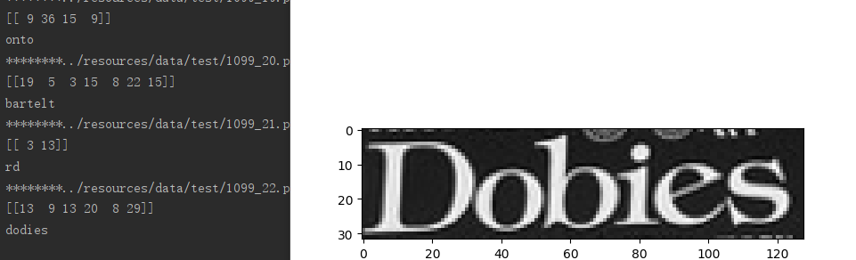
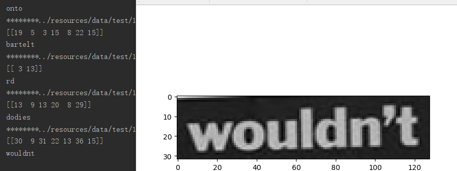

## 字符识别

ocr based on [crnn](http://arxiv.org/pdf/1507.05717)

基于crnn的字符识别
-----

## usage

> predata
>> predata/image.py 对图片预处理
>
>> predata/text.py 对文字预处理
>
> v1
>> v1/ImageGenerator.py 生成器
>
>> v1/model.py 模型
>
>> v1/train.py 训练
>
>> v1/predict.py 预测

直接运行predict.py 即可

## reference

[An End-to-End Trainable Neural Network for Image-based Sequence Recognition and Its Application to Scene Text Recognition](http://arxiv.org/pdf/1507.05717)